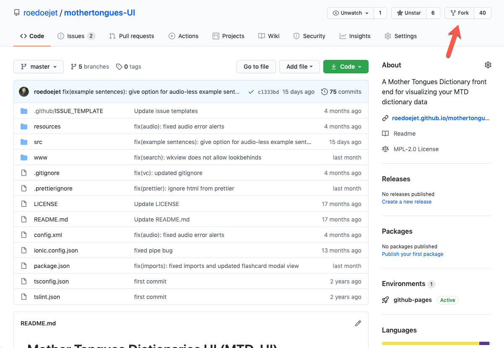
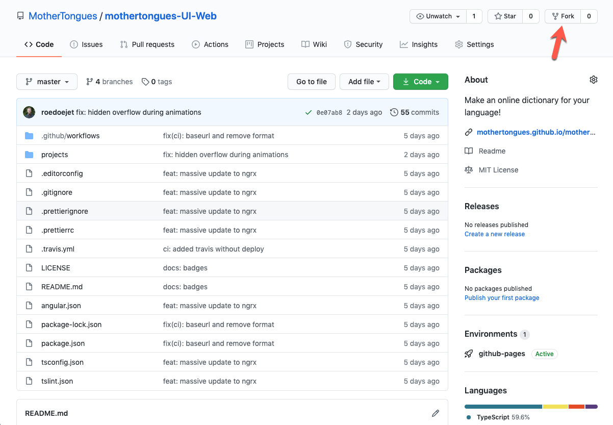

*These guides assume you are comfortable with the [Command Line](https://en.wikipedia.org/wiki/Command-line_interface), [Git](https://en.wikipedia.org/wiki/Git) and [NPM](https://en.wikipedia.org/wiki/Npm_(software)). You must have all of these installed on your machine. You are also strongly encouraged to have a [GitHub](https://github.com) account. You are encouraged to fork or clone the [Mother Tongues Dictionary Starter](https://github.com/roedoejet/mtd-starter) and follow along.*

### Adding a User Interface

This is a guide for visualizing your data through a user interface. 

:::important
This guide assumes you have worked through all the steps in [preparing your data](mtd-guides-prepare).
:::

### Exporting your data

First, you need to export the JavaScript files required by any MTD UI.

1.  Change directories to your [MTD folder](mtd-guides-prepare#file-structure).
2.  Then, build the dictionary using the `mtd export` command to create
    necessary JavaScript files. For example, given a dictionary named
    `abc`, a Language configuration file named `abc_config.json`, and a
    desired output folder `output`, run the following:

`mtd export abc_config.json js output`

Because we are in our MTD folder, we can just run `mtd export . js .`

:::note
This command will compile ALL the configuration files in the current directory.
:::

You will see various messages displayed, potentially including info,
warnings, and errors, which are ordered in terms of severity. If there
are only info messages, the command executed successfully, and the info
might advise you on how to improve your configuration inputs. If there
are warnings (which may be in addition to info messages), the command
executed but there might be serious issues with the output files. If
there are errors (which may be in addition to info messages and
warnings), the command did not execute successfully.

Checking your output folder, you should see two files: `config-abc.js`
and `dict_cached-abc.js`. These files contain the data for your
dictionary.

Once you have built your dictionary files, you can add them to a
dictionary UI such as an [MTD
mobile UI](https://github.com/roedoejet/mothertongues-ui) or [MTD
web UI](https://github.com/MotherTongues/mothertongues-ui-web).

:::tip
By simply changing the `config-*.js` and `dict_cached-*.js` files in your MTD Starter (and updating the `index.html` if the filenames changed) GitHub will automatically build your dictionary using the [MTD
mobile UI](https://github.com/roedoejet/mothertongues-ui).
:::

### MTD Mobile

Here are the steps for creating a mobile dictionary on your machine.

1. Fork the repository in GitHub: 

2. Clone your fork onto your local machine:

`git clone https://github.com/<YOUR_GITHUB_USERNAME>/mothertongues-ui`

3. Add the original repo as another remote so you can pull changes later:

`git remote add mtd https://github.com/roedoejet/mothertongues-ui`

4. Change into the directory: 

`cd mothertongues-ui`

5. Install dependencies: 

`npm install`

6. Move your [exported data](#exporting-your-data) to `mothertongues-ui/src/assets/js` and change the names to just `config.js` and `dict_cached.js` respectively, overwriting the config and data files that are already there.

7. Run your dictionary: 

`ionic serve`

### MTD Web

Here are the steps for creating a web dictionary on your machine.

1. Fork the repository in GitHub: 

2. Clone your fork onto your local machine:

`git clone https://github.com/<YOUR_GITHUB_USERNAME>/mothertongues-ui-web`

3. Add the original repo as another remote so you can pull changes later:

`git remote add mtd https://github.com/mothertongues/mothertongues-ui-web`

4. Change into the directory: 

`cd mothertongues-ui-web`

5. Install dependencies: 

`npm install`

6. Move your [exported data](#exporting-your-data) to `mothertongues-ui-web/projects/mtd/src/assets/js` and change the names to just `config.js` and `dict_cached.js` respectively, overwriting the config and data files that are already there.

7. Run your dictionary: 

`npm start`

8. Commit your changes and push. Your site will be published at `https://<YOUR_GITHUB_HANDLE>.github.io/mothertongues-UI-Web/`:

`git commit -a -m 'updated data' && git push origin master`

